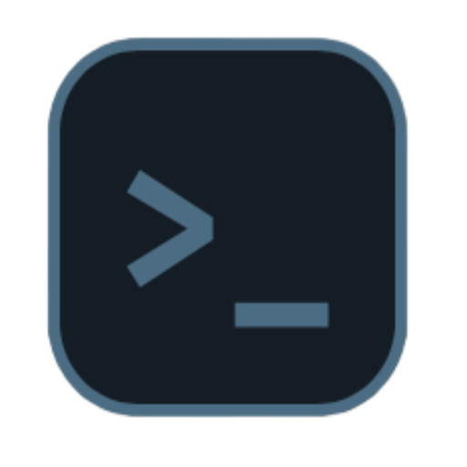

<div align="center">
  
  <h1>UnifyStudy</h1>
  <p><strong>The Ultimate All-in-One Academic Ecosystem</strong></p>

  <p>
    <a href="https://react.dev/"></a>
    <a href="https://www.typescriptlang.org/"></a>
    <a href="https://www.electronjs.org/"></a>
    <a href="https://vitejs.dev/"></a>
  </p>
</div>

<br />

## 🚀 About UnifyStudy

UnifyStudy is a powerful, desktop-first productivity platform designed to centralize every aspect of student life. Built with modern web technologies and wrapped in Electron, it combines rigid planning tools with flexible creativity spaces to help you master your studies.

From tracking grades and managing timetables to collaborating in real-time and gamifying your habits, UnifyStudy bridges the gap between academic management and social learning.

---

## ✨ Features

### 📚 Academic Management
- **Smart Timetable**: Drag-and-drop scheduling for classes, exams, and holidays.
- **Grade Tracking**: Master-detail views for monitoring academic performance.
- **Assignment Tracker**: Kanban-style or list views for deadline management.

### 🧠 Learning & Focus
- **Flashcards (v2)**: Advanced Anki-style spaced repetition system (SRS) for efficient memorization.
- **Mind Maps**: Visual brainstorming tools powered by React Flow.
- **Focus Mode**: Custom Pomodoro timers with immersive ambient soundscapes (Rain, Wind, Cafe).
- **Notes**: Rich-text collaborative note-taking.

### 👥 Social & Gamification
- **Real-time Chat**: Direct messages and group channels tailored for study groups.
- **Leaderboards**: Compete with friends on study time and habit streaks.
- **Habit Tracker**: Daily tracking with streaks and analytics.
- **Shop & Profile**: Customize your experience with themes and profile tags.

### 🛠️ Utilities
- **Workspace**: Built-in file management system for organizing study materials.
- **Nova AI Assistant**: Integration for smart study assistance.
- **Analytics Dashboard**: Visual insights into your productivity trends.

---

## 🛠️ Tech Stack

**Core**
*   **Framework**: [React 18](https://react.dev/)
*   **Language**: [TypeScript](https://www.typescriptlang.org/)
*   **Styling**: SCSS (Sass) Modules & Global Styles
*   **Desktop Runtime**: [Electron](https://www.electronjs.org/)

**Ecosystem & Tools**
*   **Build Tool**: [Vite](https://vitejs.dev/)
*   **State**: React Context & Hooks
*   **Data**: Firebase (v12)
*   **Routing**: React Router DOM (v7)
*   **Animations**: Framer Motion
*   **Charts**: Recharts
*   **Forms**: React Hook Form + Zod
*   **Flow Diagrams**: React Flow

---

## 💻 Getting Started

Follow these steps to set up the project locally.

### Prerequisites
*   Node.js (v18 or higher recommended)
*   npm or yarn

### Installation

1.  **Clone the repository**
    ```bash
    git clone https://github.com/socom1/unifystudy.git
    cd unifystudy
    ```

    *Note: The project code is located in the `unifystudy` subdirectory.*
    ```bash
    cd unifystudy
    ```

2.  **Install dependencies**
    ```bash
    npm install
    ```

### Development

To run the application in development mode:

1.  **Start the React Dev Server** (in one terminal)
    ```bash
    npm run dev
    ```

2.  **Launch Electron** (in a second terminal, once Vite is ready)
    ```bash
    npm run electron
    ```

*Note: The application will launch a desktop window with Hot Module Replacement (HMR) enabled.*

### Building

To create a distributable installer for your OS:

- **macOS**: `npm run build:mac`
- **Windows**: `npm run build:win`
- **Linux**: `npm run build:linux`

The installers will be output to the `installers` or `dist` directory.

---

## 🤝 Contributing

Contributions are welcome! Please feel free to submit a Pull Request.

1.  Fork the Project
2.  Create your Feature Branch (`git checkout -b feature/AmazingFeature`)
3.  Commit your Changes (`git commit -m 'Add some AmazingFeature'`)
4.  Push to the Branch (`git push origin feature/AmazingFeature`)
5.  Open a Pull Request

---

<div align="center">
  <p>Built with ❤️ by Rejus Zuzevicius</p>
  <p>© 2026 UnifyStudy. All Rights Reserved.</p>
</div>
