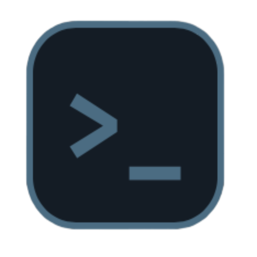
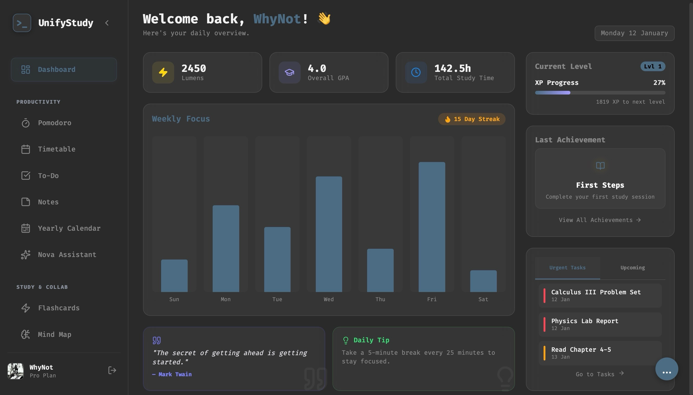
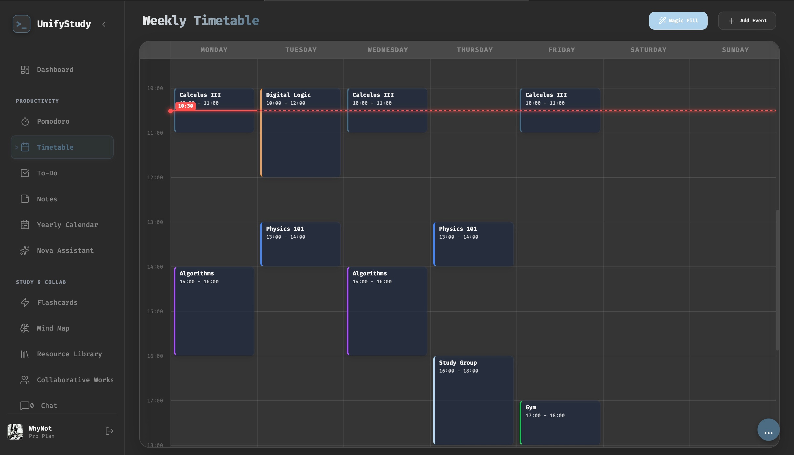
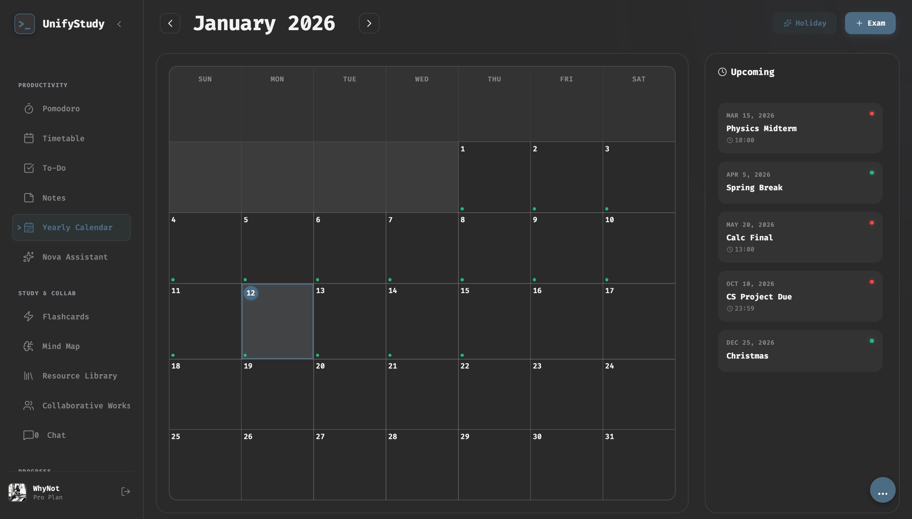
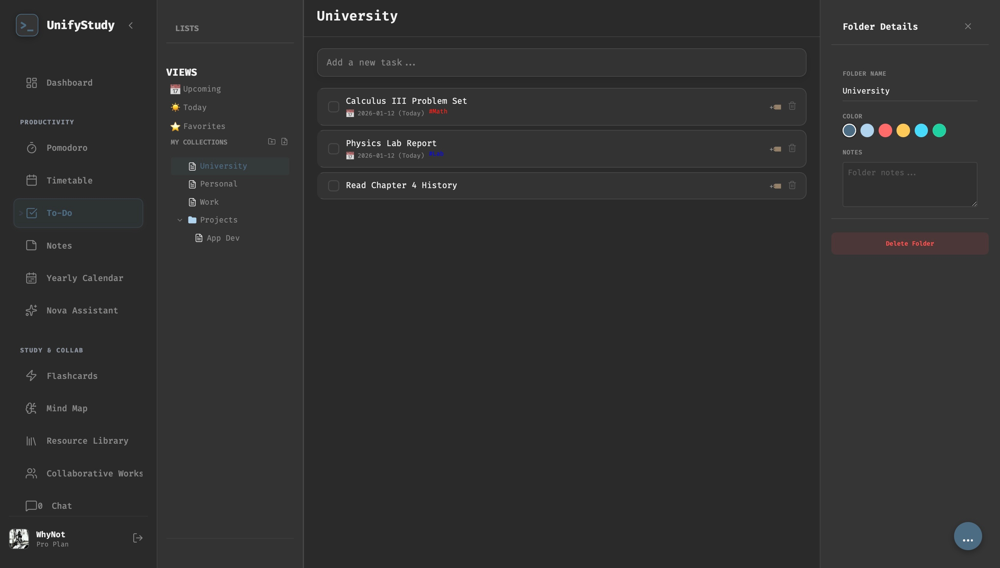

<div align="center">
  
  <h1>UnifyStudy</h1>
  <p><strong>The All-in-One Academic Ecosystem</strong></p>

  <p>
    <a href="https://react.dev/"></a>
    <a href="https://www.typescriptlang.org/"></a>
    <a href="https://www.electronjs.org/"></a>
    <a href="https://vitejs.dev/"></a>
  </p>
</div>

<br />

## 🚀 About UnifyStudy



**UnifyStudy** is a student productivity platform built to centralize your entire academic life. Designed with modern web technologies, it provides rigid planning utilities alongside customizable study spaces. Whether you want to install it as a PWA on your phone or run it as a standalone Electron desktop app, UnifyStudy directly bridges the gap between academic management and efficient focus.

## ✨ Core Features

| **Interactive Timetable** | **Yearly Calendar** |
|:---:|:---:|
|  |  |
| Manage classes and weekly routines. | Track holidays, exams, and milestones. |

### ✅ Advanced To-Do List

*Organize tasks with folders, strict priority filtering, and keyboard-driven navigation.*

---

## 🔥 Features Stack

### 📚 Academic Management
- **Smart Timetable**: Drag-and-drop scheduling for classes, exams, and holidays.
- **Grades & GPA**: Master-detail views for accurately tracking your academic performance.
- **Urgent Task Hub**: Kanban-style or chronological list views for deadline management.

### 🧠 Learning & Focus
- **Flashcards (v2)**: Built-in Anki-style spaced repetition system (SRS) for memorization.
- **Mind Maps**: Infinite canvas visual brainstorming powered by React Flow.
- **Zen Focus Mode**: Integrated Pomodoro timers with ambient soundscapes (Rain, Wind, Cafe).
- **Push Notifications**: Native desktop and mobile alerts notify you the moment your focus sprint or break ends.

### 🛡️ Production & Security Setup (New in 1.0.1)
- **Installable PWA**: Install UnifyStudy straight to your iOS/Android home screen.
- **GDPR Compliance**: Built-in 1-click JSON Data Exports and absolute Account Deletion options in your settings.
- **Security Hardening**: Anti-XSS sanitized inputs, explicit Firebase rules, and React Error Boundaries preventing crash loops.
- **Accessibility**: Full screen-reader ARIA labeling and tab-targeting for keyboard power-users.

### 👥 Social & Progression
- **Study Streak**: Automatic tracking of study time and daily consecutive streaks.
- **Leaderboards**: Compete against other students based on total study time.
- **Achievements**: Unlock custom badges as you hit specific study milestones.

---

## 🛠️ Tech Stack

**Frontend Environment**
*   **Core**: React 18 & TypeScript
*   **Styling**: SCSS (Sass) Modules & Global Styles
*   **Build Engine**: Vite (PWA Plugin Configured)
*   **Desktop Runtime**: Electron

**Data & Analytics Ecosystem**
*   **Backend**: Firebase v12 (Auth, Realtime DB, Storage, Analytics)
*   **Routing**: React Router DOM v7
*   **Motion**: Framer Motion
*   **Security Validation**: Zod & DOMPurify

---

## 💻 Getting Started

Follow these steps to run UnifyStudy locally. 

### Prerequisites
*   Node.js (v18 or higher recommended)
*   npm or yarn

### Installation

1.  **Clone the repository**
    ```bash
    git clone https://github.com/socom1/unifystudy.git
    cd unifystudy/unifystudy
    ```
    *(Note: The main application code is nested inside the `unifystudy` directory).*

2.  **Environment Variables (Crucial)**
    Copy the example template and fill out your Firebase credentials to avoid startup sequence crashes.
    ```bash
    cp .env.example .env
    ```

3.  **Install dependencies**
    ```bash
    npm install
    ```

### Development

You can run UnifyStudy in the browser or as a native desktop app:

1.  **Web / PWA Server** (In terminal 1)
    ```bash
    npm run dev
    ```

2.  **Launch Electron** (In terminal 2, wait for Vite to compile first)
    ```bash
    npm run electron
    ```

*Note: The application has Hot Module Replacement (HMR) active across both platforms.*

### Building Downloadable Installers

To create an installer package for your operating system:
- **macOS**: `npm run build:mac`
- **Windows**: `npm run build:win`

Output files generate silently to the `installers` or `dist` directories.

---

## 🤝 Contributing

Contributions are welcome! Please feel free to open a Pull Request.

1.  Fork the Project
2.  Create your Feature Branch (`git checkout -b feature/AmazingFeature`)
3.  Commit your Changes (`git commit -m 'Add some AmazingFeature'`)
4.  Push to the Branch (`git push origin feature/AmazingFeature`)
5.  Open a Pull Request

---

<div align="center">
  <p>Built with ❤️ by Rejus Zuzevicius</p>
  <p>© 2026 UnifyStudy. All Rights Reserved.</p>
</div>
